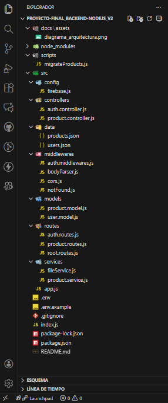

# 🧩 Proyecto Final Integrador – Back-End Node.js | Talento Tech

## 📘 Descripción general

Este proyecto forma parte del **Trabajo Final Integrador** del trayecto Back-End con Node.js del programa **Talento Tech**.

Consiste en el desarrollo de una **API RESTful** para una tienda en línea, construida con **Node.js** y **Express.js**, que permite gestionar recursos mediante solicitudes HTTP, aplicando los principios fundamentales de la arquitectura cliente-servidor.

A lo largo del desarrollo se implementaron conceptos clave como:

- Diseño de endpoints con rutas predefinidas, lectura de parámetros y manejo de códigos de respuesta.

- Separación de responsabilidades mediante **controladores**, **servicios** y **modelos**, siguiendo una estructura modular y escalable.

- Consumo de datos desde archivos locales en formato **JSON** y desde servicios en la nube como **Firebase** Firestore, comprendiendo su diferencia con bases de datos tradicionales.

- Configuración de una capa de **autenticación** para garantizar la seguridad del sistema, alineada con estándares actuales.

## 🚀 Características principales

Esta **API RESTful** fue diseñada con foco en la modularidad, la escalabilidad y la seguridad. A lo largo del desarrollo se implementaron las siguientes funcionalidades clave:

- 🧭 Gestión de recursos mediante endpoints **HTTP** (`GET`, `POST`, `PUT` y `DELETE`) para operaciones **CRUD**.

- 🧱 Arquitectura modular con separación de responsabilidades en controladores, servicios, modelos y rutas.

- 🔐 Autenticación de usuarios con validación de credenciales y generación de **tokens JWT**.

- ☁️ Persistencia de datos en **Firebase Firestore**, con lógica desacoplada para facilitar futuras migraciones.

- 🛡️ Manejo centralizado de errores, con respuestas claras y consistentes para distintos escenarios.

- 📦 Configuración segura mediante variables de entorno (`.env`) para credenciales y claves sensibles.

- 📄 Documentación clara del flujo de trabajo, decisiones técnicas y estructura del proyecto.

- 🧪 Validaciones de entrada para asegurar la integridad de los datos recibidos por la API.

- 🔄 Sincronización entre capas que permite mantener la lógica limpia y fácilmente testeable.

## 🛠️ Tecnologías utilizadas

Este proyecto fue desarrollado utilizando herramientas modernas del ecosistema JavaScript, priorizando la modularidad, la seguridad y la escalabilidad.

### 🧩 Core del proyecto

- `Node.js` - Entorno de ejecución para **JavaScript** en el servidor.

- `Express.js` - **Framework minimalista** para construir la API RESTful.

### ☁️ Persistencia de datos

- `Firebase Firestore` - **Base de datos NoSQL** en la nube, utilizada para almacenar y consultar datos de forma escalable.

### 🔐 Seguridad y autenticación

- `jasonwebtoken (JWT)` - Generación y verificación de **tokens para autenticación**.

- `bcrypt` - Para proteger las contraseñas de los usuarios, en lugar de almacenar contraseñas en texto plano, se guardan **hashes seguros**

### 📦 Utilidades y configuración

- `dotenv` - Manejo de variables de entorno para proteger credenciales y configuraciones sensibles.

- `cors` - Configuración de políticas de acceso entre dominios.

### 🧪 Validación y manejo de errores

- Middleware personalizado para manejo centralizado de errores.

- `middleware global de manejo de errores` - Para garantizar respuestas consistentes y evitar rupturas en el servidor, este middleware captura excepciones y devuelve respuestas JSON uniformes.

## Instalación

1.  Clonar el repositorio:
    ```bash
    git clone https://github.com/ngatti68/Proyecto-Final_Back-End_NodeJS.git
    ```
2.  Navegar al directorio del proyecto:
    ```bash
    cd Proyecto-Final_Back-End_NodeJS
    ```
3.  Instalar las dependencias:
    ```bash
    npm install
    ```

3. 	Configurar variables de entorno en `.env`

## Migración de productos (setup inicial)

- Ejecuta el script para cargar los productos base en Firebase:
    ```bash
    npm run migrate:products
    ```
- Esto asegura que la colección `products` tenga datos iniciales antes de probar los endpoints.

## Ejecución

- **Iniciar el servidor:**
  ```bash
  npm start
  ```
- **Iniciar en modo de desarrollo (con reinicio automático):**
  ```bash
  npm run dev
  ```

## 🔍 Diagrama de arquitectura



### Este diagrama muestra cómo se conectan los controladores, servicios y Firestore.

## 📡 Endpoints de la API

La siguiente tabla resume los principales endpoints disponibles en la API, organizados por recurso y método HTTP:

### 🔐 Autenticación y registro

| Método | Ruta                      | Descripción                       | Autenticación |
| ------ | ------------------------- | --------------------------------- | ------------- |
| POST   | `auth/register`           | Registra un nuevo usuario         | No            |
| POST   | `auth/login`              | Inicia sesión y genera token JWT  | No            |

### 🛒 Productos

| Método | Ruta                      | Descripción                       | Autenticación | Roles requeridos |
| ------ | ------------------------- | --------------------------------- | ------------- | ---------------- |
| GET    | `/api/products`           | Obtiene todos los productos       | Sí (JWT)      | Usuario/Admin    |
| GET    | `/api/products/:id`       | Obtiene un producto por ID        | Sí (JWT)      | Usuario/Admin    |
| GET    | `/api/products/:category` | Obtiene un producto por categoria | Sí (JWT)      | Usuario/Admin    |
| POST   | `/api/products/create`    | Crea un nuevo producto            | Sí (JWT)      | Admin            |
| PUT    | `/api/products/:id`       | Actualiza un producto existente   | Sí (JWT)      | Admin            |
| DELETE | `/api/products/:id`       | Elimina un producto por ID        | Sí (JWT)      | Admin            |

🔑 Autenticación

- Los endpoints protegidos requieren un token JWT en el encabezado:

```bash
Authorization: Bearer <token>
```

## 📂 Registro de usuarios

1. `POST /auth/register`

**Descripción:** Registra un nuevo usuario.

**Body (JSON)**

```bash
{
  "email": "admin@example.com",
  "password": "AdminPass123!",
  "role": "admin"
}
```

```bash
{
  "email": "user@example.com",
  "password": "UserPass456!"
}
```

### Posibles respuestas:

- ✅ 201 `Created` → `{ "message": "Usuario registrado" }`

- ⚠️ 400 `Bad Request` → `{ "message": "Usuario ya existe" }`


## 📂 Login de usuarios

2. `POST /auth/login`

**Descripción:** Inicia sesión y genera token JWT. 

**Body (JSON)**

```bash
{
  "email": "admin@example.com",
  "password": "AdminPass123!"
}  
```

```bash
{
  "email": "user@example.com",
  "password": "UserPass456!"
} 
```

### Posibles respuestas:

- ✅ `200 OK` → `{ "token": "<JWT_TOKEN>" }`

- ⚠️ `404 Not Found` → `{ "message": "Usuario no encontrado" }`

- ⚠️ `401 Unauthorized` → `{ "message": "Credenciales inválidas" }`

3. Consumo de endpoints protegidos

Una vez obtenido el token JWT, se debe incluir en el encabezado:

```bash
Authorization: Bearer <JWT_TOKEN>
```

## 📦 Endpoints de Productos

1. `GET /api/products`

**Descripción:** Obtiene todos los productos.

- **Headers**

```bash
Authorization: Bearer <JWT_TOKEN>
```

**Respuesta esperada (200 OK):**

```bash
[
  {
    "id": "3F9OKwaCsanAafIpbYb2",
    "name": "Silla Gamer Razer Iskur",
    "price": 400,
    "category": "muebles"
  },
  {
    "id": "J61hOsO5Hs3zMfy7UxYG",
    "name": "Campera Adidas Originals",
    "price": 180,
    "category": "ropa"
  }
]
```

2. `GET /api/products/:id`

**Descripción:** Obtiene un producto específico por su ID.

- **Headers**

```bash
Authorization: Bearer <JWT_TOKEN>
```

**Respuesta esperada (200 OK):**

```bash
{
    "id": "ZKnSKlCyi39GDaT9n31o",
    "name": "Auriculares Bluetooth Sony WH-1000XM4",
    "price": 300,
    "category": "audio"
}
```

3. `GET /api/products/:category`

**Descripción:** Obtiene productos filtrados por categoría.

- **Headers**

```bash
Authorization: Bearer <JWT_TOKEN>
```

### Ejemplo de petición:

```bash
GET /api/products/tecnologia
```

### Ejemplo de respuesta:

```bash
[
  {
    "id": "KXpWvzuSehJsvWXQIFS5",
    "name": "Monitor LG UltraWide 34´´",
    "price": 700,
    "category": "tecnologia"
  },
  {
    "id": "RNNubCyVW6Z5RvrMhjrb",
    "name": "Laptop Dell Inspiron 15",
    "price": 850,
    "category": "tecnologia"
  }
]
```

Ejemplo: Crear producto (solo admin)

4. `POST /api/products/create`

- **Headers**

```bash
Authorization: Bearer <JWT_TOKEN>
Content-Type: application/json
```

- **Body (JSON)**

```bash
{
  "id": "uXs8EmWXXJ4U51mbbYq9",
  "name": "Mesa de comedor madera",
  "price": 600,
  "category": "muebles"
}
```

### Posibles respuestas:

- ✅ `201 Created` → `{ "message": "Producto creado" }`

- ⚠️ `403 Forbidden` → `{ "message": "Acceso denegado" }` (si el usuario no es admin)


5. `PUT /api/products/:id`

**Descripción:** Actualiza los datos de un producto existente.

- **Headers**

```bash
Authorization: Bearer <JWT_TOKEN>
Content-Type: application/json
```

- **Body (JSON)**

### Ejemplo de petición:

```bash
`PUT /api/products/hAfKsepWkBPtxQcuj5Vv`
```

```bash
Authorization: Bearer <token>
Content-Type: application/json

{
  "price": 1200
}
```

### Ejemplo de respuesta:

```bash
{
    "id": "hAfKsepWkBPtxQcuj5Vv",
    "name": "Libro 'Clean Code' - Robert C. Martin",
    "price": 50,
    "category": "libros"
    "message": "Producto actualizado correctamente"
}
```

6. `DELETE /api/products/:id`

**Descripción:** Elimina un producto por su ID.

- **Headers**

```bash
Authorization: Bearer <JWT_TOKEN>
```

### Ejemplo de petición:

```bash
`DELETE /api/products/nufmceecfticdsZZ4B44`
```

```bash
Authorization: Bearer <token>
```

### Ejemplo de respuesta:

```bash
{
  "message": "Producto eliminado exitosamente"
}
```

## ⚠️ Manejo de errores

La API contempla el manejo de errores mediante respuestas estructuradas y códigos de estado HTTP apropiados. Esto permite una comunicación clara con el cliente y facilita el debugging.

### 🧭 Tipos de errores y respuestas

| Código | Tipo de error         | Descripción                                                    | Ejemplo de respuesta                            |
| ------ | --------------------- | -------------------------------------------------------------- | ----------------------------------------------- |
| 400    | Bad Request           | La petición contiene datos inválidos o está mal formada.       | `{"error":"Datos inválidos en la solicitud"}`   |
| 401    | Unauthorized          | El token de autenticación está ausente o es inválido.          | `{"error":"Token no proporcionado o inválido"}` |
| 403    | Forbidden             | El usuario no tiene permisos para acceder al recurso.          | `{"error":"Acceso denegado"}`                   |
| 404    | Not Found             | La ruta no existe o el recurso solicitado no fue encontrado.   | `{"error":"Recurso no encontrado"}`             |
| 500    | Internal Server Error | Error inesperado en el servidor o fallo en servicios externos. | `{"error":"Error interno del servidor"}`        |

### 🛡️ Comportamiento esperado

- Las rutas no definidas devuelven un error 404 con un mensaje claro.
- Las operaciones protegidas verifican el token JWT y devuelven 401 o 403 según el caso.
- Las validaciones de entrada (body, params, query) devuelven 400 si hay errores.
- Los errores inesperados, como fallos en servicios externos (e.g. Firebase), devuelven 500 con un mensaje genérico.

### 🧪 Ejemplo de error 401

```http
POST /api/products/create
Content-Type: application/json

{
  "name": "Gorra",
  "price": 19.99
}
```

## 🔐 Autenticación y seguridad

La API implementa autenticación basada en tokens JWT (JSON Web Tokens) para proteger los endpoints sensibles y garantizar el acceso seguro a los recursos.

### 🧾 Flujo de autenticación

1. El usuario inicia sesión mediante el endpoint `POST /auth/login`, proporcionando email y contraseña.
2. Si las credenciales son válidas, el servidor responde con un token JWT.
3. Este token debe incluirse en el encabezado `Authorization` de cada petición protegida:

```http
Authorization: Bearer <token>
```

## 👨‍💻 Creador del proyecto

Este proyecto fue desarrollado por **Norberto Gatti**, desarrollador backend enfocado en la construcción de APIs escalables, migración a Firebase y documentación profesional.

### 🧠 Perfil técnico

- Conocimientos de JavaScript, Node.js, Express y Firebase.
- Experiencia en arquitectura modular, manejo de errores, seguridad y autenticación con JWT.
- Enfoque en transparencia de workflow, buenas prácticas y documentación clara.
- Apasionado por construir soluciones mantenibles, seguras y accesibles para futuros colaboradores.

### 🌐 Contacto

- GitHub: [github.com/ngatti68](https://github.com/ngatti68)
- LinkedIn: [linkedin.com/in/norberto-gatti-1a42aa58](https://www.linkedin.com/in/norberto-gatti-1a42aa58/)

Este proyecto forma parte de su proceso de evaluación profesional en **Talento Tech**, y representa su compromiso con el aprendizaje continuo, la calidad técnica y la comunicación efectiva.

---
